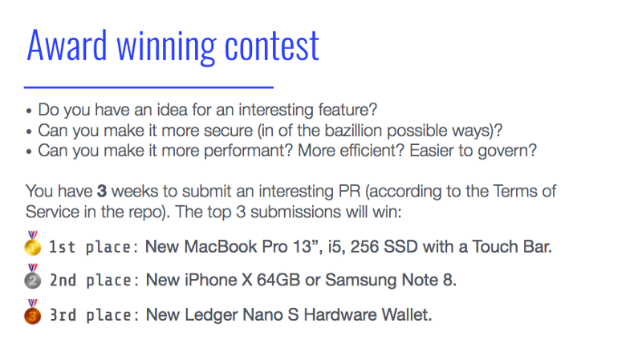

# Award Winning Contest

The blockchain that we've implemented is very basic — now, how about extending it? In case you missed it, **we’re thrilled to announce a very special competition with some awesome prizes:**

In general though, the rules are simple — make our code more awesome and the most interesting creative blockchains (as attested by our committee of blockchain experts) will win the awesome prizes above. In addition, we will be publishing the most interesting submissions (even those that didn’t make the final cut) to give them props and show the world what was possible.

This is an opportunity for you to go wild and be creative. There are numerous ways you can improve the blockchain in creative ways — you can add new features, run thousands of nodes, make it more secure, more scalable, better address its privacy, run smart contracts (we wouldn’t want to give away too many suggestions). In general make it a better more interesting blockchain. There are so many ways you can improve it and make it a better blockchain so we’re excited to see the creative things you pull off.

This is a great opportunity, for any developer, interested in learning more about blockchain to take a stab at doing something awesome. We’re excited to see what you’ll come up with, and who will end up winning the awesome prizes.

# Terms and Conditions

1. The promoter is: Cointree Ltd (company no. 515659050).

2. Entry is open to residents of Israel aged eighteen years or over only.

3. There is no entry fee and no purchase necessary to enter this competition.

4. To enter, entrants must go in person to the competition Github during the open period, open a pull request and send an Email to event@orbs.network with the pull request link and the entrants details. Incomplete or automated entries will be disqualified. Multiple entries from the same IP address, same email address or from automated competition entry services are invalid.

5. Closing date for entry will be 16/1/2018. After this date, no further entries to the competition will be permitted.

6. No responsibility can be accepted for entries not received for whatever reason
7. The prizes are as follows:
7.1. 1st place - New MacBook Pro 13", i5, 256SSD with Touch Bar.
7.2. 2nd place - New iPhone X 64GB Or Samsung Note 8.
7.3. 3rd place - New Ledger Nano S Hardware Wallet.

8. The prizes are as stated and no cash or other alternatives will be offered. The prizes are not transferable. Prizes are subject to availability and we reserve the right to substitute any prize with another of equivalent value without giving notice.

9. Winners will be chosen by a panel of judges appointed by the Promoter.

10. The promoter’s decision is final and no correspondence will be entered into.

11. The Promoter reserves the right to, at any time, verify an entry or entrant and disqualify an entrant the Promoter has reason to believe has submitted an entry not in accordance with these Terms and Conditions.

12. The promoter will notify the winner when and where the prize can be collected.

13. The competition and these terms and conditions will be governed by the Israeli law and any disputes will be subject to the exclusive jurisdiction of the courts of Tel Aviv district.

14. The winner agrees to the use of his/her name and image in any publicity material, as well as their entry.

15.	All entries in the competition become the property of the Promoter. The Promoter collects personal information from entrants to conduct the competition and may, in the course of business, disclose the personal information to third parties, as required. Entry in this competition is conditional on provision of the personal information requested. Entries may be entered into a database and the Promoter may use the entrants' names and addresses for future promotional, marketing and publicity in various forms by the Promoter, and the entrant consents to such use. Entrants may direct any request to access their personal information to the Promoter. Additionally, all literary works submitted as part of an entry become the property of the Promoter and it is a condition of entry that those literary works may be used by the Promoter for their own promotional, marketing and publicity purposes without restriction. The promoter may share the entry details with the prize provider.

16.	The Promoter reserves the right to modify, suspend or terminate the competition without notice.

17.	The Promoter is not liable for any loss (including loss of opportunity) or damage (including, but not limited to, direct, indirect or inconsequential loss) or personal injury in relation to this competition or the use of, or participation in, the prize

18.	Entry into the competition will be deemed as acceptance of these terms and conditions.

