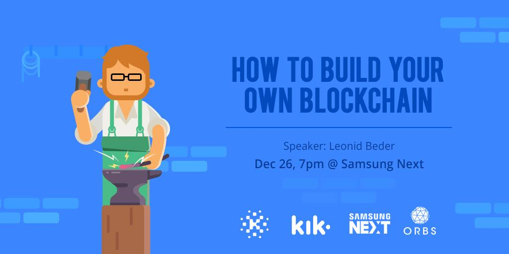

# how-to-build-your-own-blockchain

In this repository, you'll find the source code and material of our first [How to Build Your Own Blockchain](https://www.facebook.com/events/541216486228386/) event.

You can find the slides of the talk here: [How to Build Your Own Blockchain - Slides](https://www.slideshare.net/LeonidBeder/how-to-build-your-own-blockchain).

## Blockchain Academy

Blockchain Academy, the community for technologists looking to learn more about crypto and Blockchain technology.

So you’re interested in Blockchain? If you came to this page it probably means that despite the hundreds of events, groups and pages you have yet to find one entity that caters to your Blockchain needs.

If Crypto trading advice and strategy is what you’re into or if high level sessions that will provide you with buzzwords but not much else - please continue your search. However, if you’re a Blockchain professional that is interested in an active and productive discussion with other Blockchain professionals… Or if you’re a top notch backend/cloud/cyber/fintech professional that is actively looking to get a running start into a new and exciting technological field - this is the place for you.

Blockchain academy was founded by top tier professionals that have been actively working with and in Blockchain technology for years in order to provide those who use it in practice a home and a framework to help each other grow and help applicable newcomers learn the basics and a lot more. In this case; only those who can (and do) - will teach!

## License

[MIT](LICENSE)
